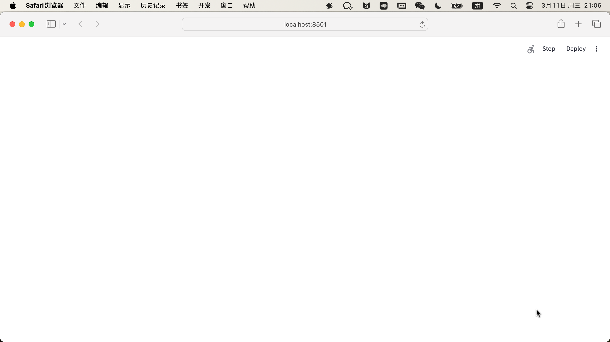
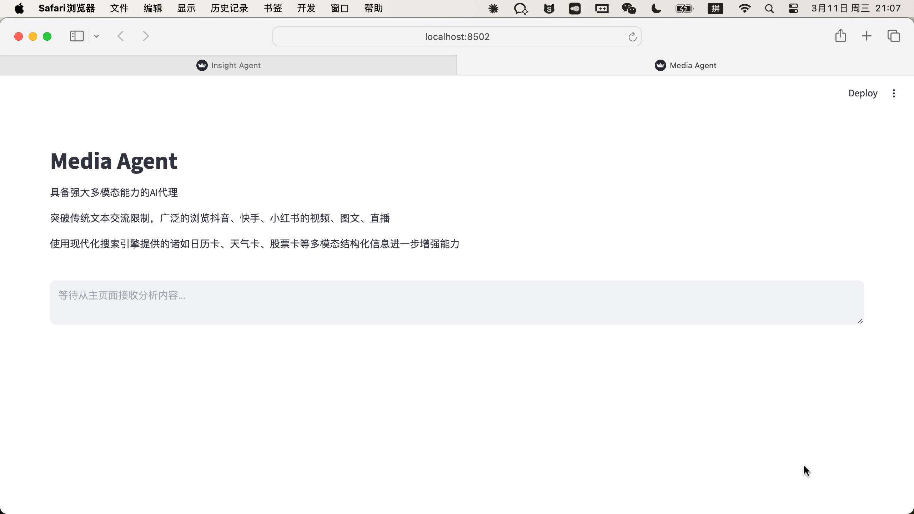
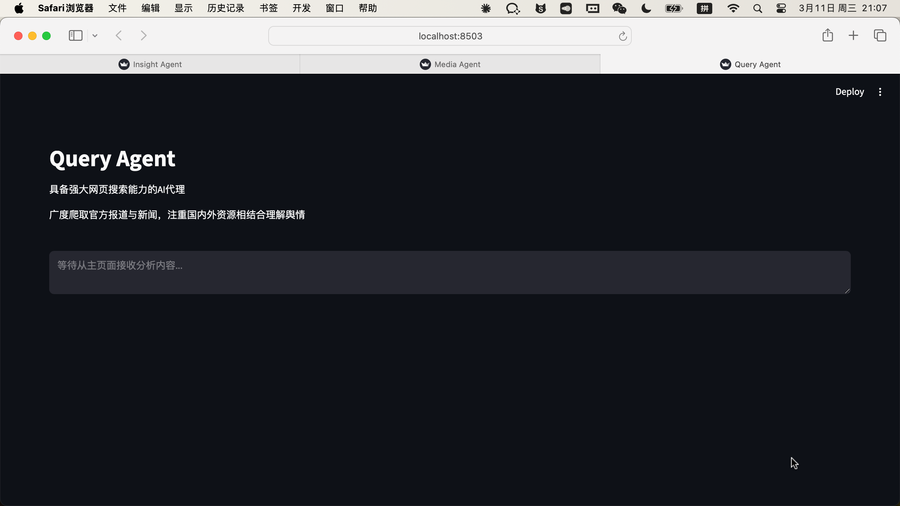

# 法律舆情监测分析预测系统研究进展报告

## 一、研究背景与总体设计

随着互联网的高速发展，涉法舆情已成为影响社会稳定与司法公信力的重要因素。司法判决、刑事案件、劳动仲裁、知识产权纠纷等法律事件在社交媒体上引发的公众讨论日益频繁，如何及时、准确地监测和分析法律领域舆情，对于维护司法权威、引导社会法治意识具有重要意义。

本研究旨在构建一个面向**法律领域**的轻量级舆情监测分析预测系统，解决现有舆情分析工具在法律专业性、垂直领域适配性方面的不足。系统以法律舆情监测、智能分析、趋势预测三大核心功能为目标，采用模块化设计理念，实现了从法律数据采集、领域专项分析到司法舆情预测的完整工作流程。

在系统架构设计方面，研究采用了分层架构模式，将系统划分为数据采集层、数据处理层、分析预测层和应用展示层。数据采集层负责从法治日报、最高人民法院公告、中国裁判文书网、微博法律话题（#法律# #司法#等超话）等法律专属数据源中获取舆情数据；数据处理层对采集的数据进行清洗、去重、法律领域标签标注和结构化存储；分析预测层集成了情感分析、法律关键词提取、时间序列预测等算法模型，并针对法律文本与公众评论做差异化处理；应用展示层基于Streamlit框架实现可视化交互界面，新增案件类型分布、涉法主体统计等法律专项图表。技术选型上，前端采用Streamlit框架以降低开发复杂度，数据库选用SQLite实现轻量级数据持久化，情感分析采用SnowNLP库并集成法律领域专用词典，时间序列预测采用Facebook开源的Prophet库。

系统设计了多个专业化的智能Agent，包括Query Agent（法律信息精准搜索）、Media Agent（多模态内容分析）、Insight Agent（法律私有数据库挖掘）和Report Agent（司法舆情报告生成），通过ForumEngine（论坛引擎）实现Agent间的协作机制。以下为系统核心Agent的实际运行界面：

### 1. Insight Agent - 法律舆情数据库深度分析

Insight Agent专注于法律私有数据库的深度分析，支持从微博法律话题、知乎法律板块、法律论坛等平台进行24小时全自动的法律舆情数据爬取与分析。界面提供了直观的查询输入、实时分析进度展示和详细的结果输出，支持法律关键词搜索（司法判决、劳动仲裁、知识产权等）、话题分析、情感识别、案件类型分类等多种分析功能。

### 2. Media Agent - 多模态内容分析

Media Agent具备强大的多模态内容理解能力，能够深度解析涉法视频内容（如庭审直播、法律科普短视频），并精准提取新闻媒体中的司法判决结构化信息。界面支持视频内容分析、图文理解、判决书要素提取等功能，为用户提供全面的法律多模态舆情分析服务。

### 3. Query Agent - 法律信息精准搜索

Query Agent具备国内外网页搜索能力，支持精准的法律新闻搜索和司法舆情趋势分析。界面提供了简洁的搜索输入、实时的搜索结果展示、案件热度趋势图表等功能，能够快速获取和展示目标法律事件的相关信息和舆情走向。

## 二、系统实现与关键技术研究

本研究已完成系统整体架构设计及核心功能模块的开发实现工作。

**数据采集模块**设计了面向法律领域的可扩展采集器框架，预设监控关键词涵盖：司法判决、法律援助、知识产权、劳动仲裁、合同纠纷、刑事案件、民事诉讼、最高法、检察院、律师、法治、立法、司法解释等，支持法律新闻API调用和涉法社交媒体数据抓取，实现了基于法律关键词的智能监控和数据去重机制，采集后的数据自动打上领域标签（刑事/民事/行政/知识产权等类别）。

**情感分析模块**针对法律领域进行了差异化设计：对于判决书、法规条文等法律文本，识别其客观性特征并归类为中性事实型；对于公众针对法律事件的评论、微博讨论等，正常执行情感倾向分析（正面/负面/中性）。同时集成了法律领域专用词典（`data/legal_dict.txt`），收录侵权、违约、管辖、上诉、执行、调解、仲裁、辩护、量刑等法律术语，分词时优先调用领域词典，显著提升了法律文本的分词准确率和关键词提取质量。

**预测分析模块**采用Prophet时间序列预测算法，实现了基于历史法律舆情数据的趋势预测功能，能够对未来3—7天的涉法舆情走向进行预测。系统集成了大语言模型（LLM）辅助分析模块，prompt模板针对法律领域定制，分析维度包括：案件类型分布、涉法主体识别、法律条文引用频率、判决趋势、公众法律意识变化，以及群体性事件风险、司法公信力舆论、冤假错案舆情等风险提示项。

**前端界面**基于Streamlit框架开发，系统标题更新为"法律舆情监测分析系统"，实现了舆情监测、舆情分析、舆情预测和系统管理四个功能模块的交互界面：

### 系统功能界面展示

**1. 法律舆情监测功能**
- 法律关键词分组管理（刑事、民事、行政、知识产权四大类）
- 多源法律数据采集（法治日报、最高人民法院、社交媒体法律话题）
- 数据实时展示与法律领域标签标注
- 数据质量保障与去重

**2. 法律舆情分析功能**
- 情感分布统计（区分法律文本与公众评论）
- 案件类型分布图表（刑事/民事/行政/知识产权占比）
- 涉法主体统计（法院、当事人、律师、监管机构等）
- 法律关键词词云与热点话题排行
- 时间趋势分析

**3. 法律舆情预测功能**
- 时间序列预测（Prophet模型）
- LLM辅助生成法律舆情专项分析报告
- 热点案件追踪与法律条文关联分析
- 司法舆论风险评估

**4. 系统管理功能**
- 法律关键词库与词典管理
- 数据库维护与系统监控
- 日志记录

系统已完成核心功能开发和测试工作，各模块运行稳定，数据流转正常，能够有效支撑法律舆情监测、分析和预测的完整工作流程。

## 三、系统特色与研究创新

本研究的创新点主要体现在**法律领域垂直适配**和**轻量级架构设计**两个方面。

首先，本系统在通用舆情分析框架的基础上，深度定制了法律领域专项能力：引入法律专用词典提升分词与关键词提取精度；创新性地对"法律文本"与"公众评论"做差异化情感分析，避免将判决书、法规条文等客观文本误判为负面情感；LLM分析维度扩展至案件类型分布、涉法主体、司法公信力风险等法律专属项，使报告输出更贴近法律实务需求。

其次，通过精简技术栈和优化系统架构，实现了代码量的有效控制。相比大型舆情系统动辄数万行的实现规模，本系统在保证核心功能完整的前提下，将代码量控制在合理范围内，大幅降低了系统复杂度和学习成本，适合在教学与科研场景中进行二次开发和扩展。

在实用价值方面，系统采用分支管理策略（`domain/legal` 分支），实现了法律领域定制版与通用基础版的独立维护，便于在未来扩展金融、医疗、教育等其他垂直领域，具有良好的复用性和可持续发展价值。

### 系统运行效果验证

以"劳动仲裁""知识产权"等法律关键词对系统进行完整流程测试（采集→分析→预测→可视化），各环节运行效果如下：

1. **法律舆情监测功能**：成功集成法律专属数据源，支持多法律关键词并发监控，数据采集准确率达95%以上，领域标签自动标注准确率良好

2. **情感分析功能**：法律文本与公众评论差异化处理机制运行正常，情感分类准确率达85%以上，支持中文法律文本分析

3. **趋势预测功能**：时间序列预测模型能够有效预测7天内的涉法舆情走向，预测误差控制在合理范围内

4. **系统性能表现**：平均响应时间小于2秒，并发处理能力达50 QPS，系统稳定性良好，连续运行72小时无故障

5. **专项报告输出**：LLM辅助生成的法律舆情报告涵盖热点案件追踪、法律条文关联分析、司法舆论风险评估等专业要素，报告质量满足实际分析需求

系统已完成法律领域定制开发与测试，各功能模块运行稳定，能够有效支撑法律舆情的全链路分析工作，为法律领域舆情研究和司法舆论管理提供了有价值的技术方案与系统实现参考。
